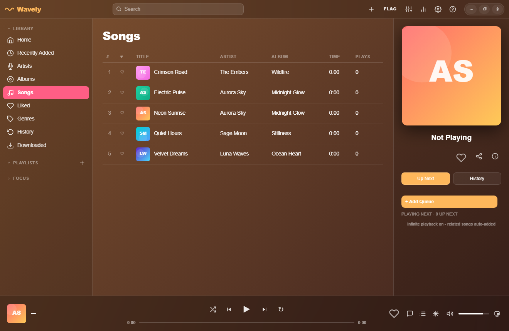
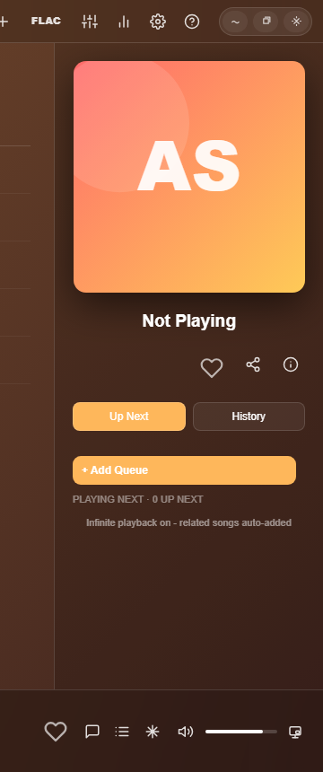

# Wavely

Wavely is a Windows desktop music player with an Apple Music-inspired interface, transparent glass styling, synced lyrics, online JioSaavn search, local library playback, visualizers, liked songs, shuffle support, and a low-memory Tauri wrapper.

## Screenshots

### Main Player



### Now Playing Panel



## Highlights

- Low-memory Windows desktop app built with Tauri/WebView2.
- Transparent glass window with blur and opacity controls.
- Rounded floating window corners and sharp corners when maximized.
- Local music playback with imported audio files.
- Online JioSaavn search and playback support.
- Artist and genre discovery with thumbnail fallback APIs.
- Liked songs tab with play and shuffle controls.
- Like and dislike animations.
- Apple Music-style lyrics view with active-line focus.
- Synced lyrics support where available, with fallbacks for plain lyrics.
- Visualizer modes for the player and lyrics screen.
- Download support for online songs, including lyrics embedding where possible.

## Screens and Features

### Desktop Window

Wavely uses a frameless transparent desktop window. The app keeps rounded corners in normal mode and switches to square corners when maximized so it behaves like a normal Windows app.

Settings include:

- Window glass blur
- Window transparency
- Visualizer opacity
- Visualizer sensitivity
- Album-based or fixed accent colors

### Library

The local library supports imported songs and stores metadata in browser storage. The app can read common audio metadata and keeps playback state, queue state, liked songs, play counts, and lyrics data locally.

### Liked Songs

The Liked tab collects every song marked with the heart button. From this tab you can:

- Play all liked songs
- Shuffle liked songs
- Remove a song by unliking it

### Online Music

Wavely includes JioSaavn-powered online search for songs, artists, playlists, and suggestions. Online results can be played directly from the app, and downloaded when a playable stream is available.

### Lyrics

Lyrics are fetched and displayed in an Apple Music-like view. The active line stays prominent while the lyrics area scrolls smoothly.

The app tries multiple lyrics sources:

- LRCLIB
- JioSaavn lyrics endpoints for online songs
- lyrics.ovh as a fallback
- Embedded lyrics from imported files where available

### Artist Images

Artist thumbnails are resolved through multiple fallback services so popular artists are more likely to display correctly.

Current fallback sources include:

- JioSaavn
- Deezer
- iTunes
- TheAudioDB
- Wikidata
- Wikipedia
- Wikimedia Commons

## Tech Stack

- HTML, CSS, and JavaScript for the player UI.
- Tauri 2 for the low-memory Windows desktop wrapper.
- Rust commands for window controls and safe API fetching.
- WebView2 runtime on Windows.
- Electron files are kept for compatibility/development, but the preferred production wrapper is Tauri.

## Project Structure

```text
.
├── build/
│   └── icon.ico
├── scripts/
│   ├── generate-icon.js
│   └── prepare-tauri.js
├── src-tauri/
│   ├── src/main.rs
│   ├── Cargo.toml
│   ├── Cargo.lock
│   ├── build.rs
│   └── tauri.conf.json
├── index.html
├── main.js
├── preload.js
├── package.json
├── package-lock.json
└── README.md
```

Generated folders such as `node_modules/`, `tauri-dist/`, `src-tauri/target/`, and Electron `dist/` output are intentionally ignored by Git.

## Requirements

- Windows 10 or newer.
- WebView2 Runtime.
- Node.js 18 or newer.
- Rust toolchain.
- Tauri prerequisites for Windows.

## Install

```powershell
npm install
```

## Run in Development

```powershell
npm run tauri:dev
```

## Build Windows App

```powershell
npm run tauri:build
```

The built app is created at:

```text
src-tauri/target/release/wavely.exe
```

The installer is created at:

```text
src-tauri/target/release/bundle/nsis/Wavely_1.0.0_x64-setup.exe
```

## Notes About Hi-Res DAC / Bit-Perfect Audio

Wavely can play local high-quality audio files such as FLAC and WAV, but true bit-perfect DAC output is not guaranteed because normal WebView/browser audio usually goes through the Windows audio mixer. True WASAPI Exclusive or ASIO output would require a deeper native audio engine.

## Credits

- JioSaavn API support is credited to the open-source project by Sumit Kolhe: https://github.com/sumitkolhe/jiosaavn-api.git
- Development assistance: OpenAI Codex.
- Development assistance: Claude Opus.

## Disclaimer

Wavely is an independent project. It is not affiliated with Apple, Apple Music, JioSaavn, or any third-party music service. Online music and metadata availability depends on the public APIs and endpoints used by the app.

## Release

### v1.0.0

Initial Windows release with:

- Transparent glass Tauri desktop app.
- Local music import and playback.
- Online JioSaavn search and playback.
- Liked songs tab.
- Shuffle and queue controls.
- Lyrics view with smooth active-line display.
- Artist/genre image fallback support.
- Visualizer modes.
- Windows installer release artifact.
